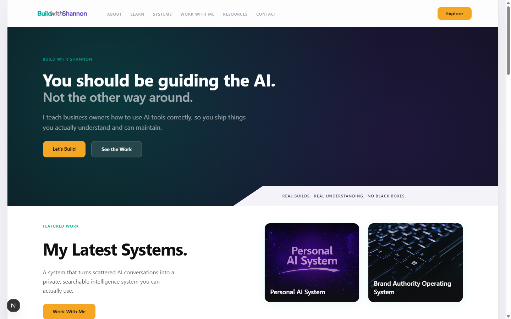

# Build With Shannon

## Overview

Build With Shannon is a premium personal brand website designed to present Shannon as a builder, teacher, and systems-focused creator working with AI.




The site is built as a brand headquarters, not a portfolio. It gives visitors clear paths to:

- learn through tutorials, guides, and resources
- explore systems and featured work
- engage through services and contact pathways

## Project Goals

- Establish a modern, credible personal brand presence
- Communicate structured thinking and technical authority
- Support multiple audience journeys (learn, explore, work together)
- Maintain a polished, intentional visual system across all pages

## Tech Stack (High Level)

- Next.js (App Router)
- React + TypeScript
- Tailwind CSS

## What the Site Includes

- A full homepage with hero, intro strip, featured work, learning, services, resources, and CTA sections
- Inner pages for About, Learn, Systems, Work With Me, Resources, and Contact
- Reusable layout shell (header, footer, shared styling tokens)
- Accessibility and polish basics (focus states, metadata, responsive behavior)

## Architecture Snapshot

- `buildwithshannonapp/app/` contains routes, shared layout, and global styles
- `buildwithshannonapp/app/components/` contains reusable UI and section components
- `buildwithshannonapp/app/data/` contains typed content models used by sections/pages
- `buildwithshannonapp/public/images/` stores image assets used by the UI

## Run Locally

From `buildwithshannonapp/`:

```bash
npm install
npm run dev
```

For production check:

```bash
npm run build
npm start
```

